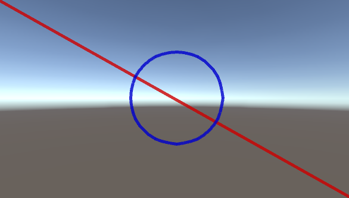

## Drawing OnGUI
Note that this should only be called during repaint events, when (Event.current.type == EventType.Repaint).

```c#
private void OnGUI()
{
	if (Event.current.type == EventType.Repaint)
	{
		Drawing.DrawLine(new Vector2(0f, 0f), new Vector2(Screen.width, Screen.height), Color.red, 5f);

		Drawing.DrawCircle(new Vector2(Screen.width / 2f, Screen.height / 2), 80f, Color.blue, 5f, 10);
	}
}
```


